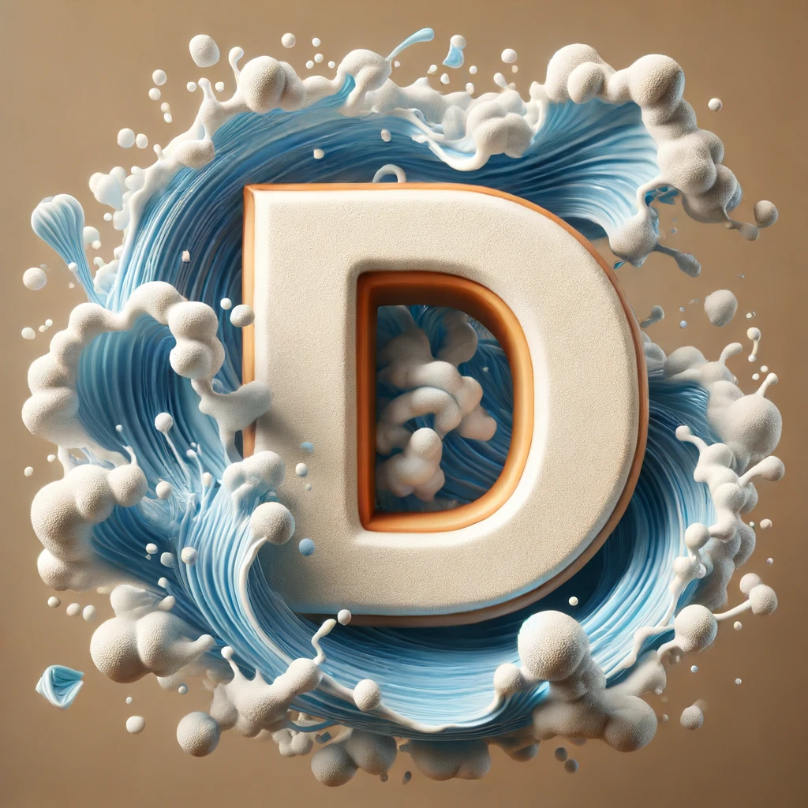

# Doriflow Fluid Simulation Engine with Blender's Render Capability
[[Website](https://doriflow.com)] [[Installation](https://doriflow.com/installation)] [[Tutorial](https://doriflow.com/tutorial)]

Doriflow is a powerful fluid simulation engine, designed to bring advanced fluid dynamics capabilities to your Blender 3D projects. It features a GPU-accelerated fluid solver, two-way fluid-rigid coupling, and whitewater generation. Whether you're working on visual effects, animations, or physical simulations, Doriflow provides the tools you need to create stunning and realistic fluid behaviors.

<figure align="center">
  
  <figcaption>Doriflow - Advanced Fluid Simulation for Blender</figcaption>
</figure>

## Features

### GPU Accelerated Fluid Solver
Our GPU-accelerated fluid solver leverages the power of modern graphics cards to perform scalable fluid simulations. This feature allows you to:

- Perform high-resolution simulations with greater efficiency.
- Faster iteration times.
- Utilize your GPU's processing power to handle complex fluid dynamics.

With GPU acceleration, Doriflow makes it possible to simulate large-scale fluid scenarios without the long wait times typically associated with CPU-based solvers.

### Two-Way Fluid Rigid Coupling
Doriflow's two-way fluid-rigid coupling feature ensures that fluids and rigid bodies interact responsively with each other. This capability includes:

- Accurate simulation of fluid forces acting on rigid bodies.
- Realistic movement and response of rigid bodies within fluid environments.
- Bidirectional interaction where fluids can affect and be affected by rigid objects.

This feature is essential for creating practical interactions between fluids and solid, such as floating shapes, submerged structures, and more.

### Whitewater Generation
Enhance your fluid simulations realism with Doriflow's whitewater generation feature. This includes:

- Creation of foam, spray, and bubbles within your fluid simulations.
- Realistic representation of turbulent fluid motion, such as breaking waves, splashes or Von Karmen vortices
- Customizable parameters to control the appearance and behavior of whitewater effects.

Whitewater generation adds an extra layer of detail and realism to your fluid simulations, making scenes involving oceans, rivers, and other water bodies more dynamic and visually appealing.

## Show cases

  
  
  
  
  
  
   

## Contribution
We welcome contributions from the community! If you have bug reports, requests, recommendation on any extra features, feel free to open issues.

## License
This project is licensed under the Creative Commons Attribution-NonCommercial 4.0 International License (CC BY-NC 4.0). See the [LICENSE](https://github.com/tien2292/Doriflow-Engine/blob/main/LICENSE) file for details.

Thank you for using Doriflow! We hope it helps you create amazing fluid simulations in Blender.
